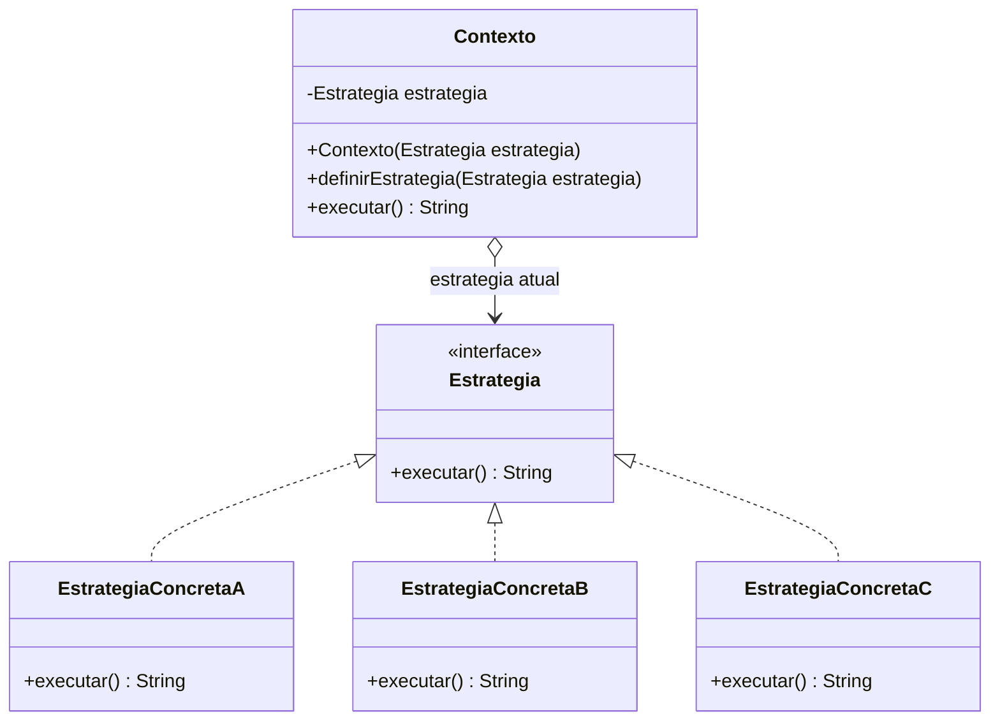

# Diagrama conceitual do Strategy

```mermaid
classDiagram
    class Contexto {
        -Estrategia estrategia
        +Contexto(Estrategia estrategia)
        +definirEstrategia(Estrategia estrategia)
        +executar() String
    }

    class Estrategia {
        <<interface>>
        +executar() String
    }

    class EstrategiaConcretaA {
        +executar() String
    }

    class EstrategiaConcretaB {
        +executar() String
    }

    class EstrategiaConcretaC {
        +executar() String
    }

    Contexto o--> Estrategia : estrategia atual
    Estrategia <|.. EstrategiaConcretaA
    Estrategia <|.. EstrategiaConcretaB
    Estrategia <|.. EstrategiaConcretaC
```

O `Contexto` usa a interface `Estrategia`.
As classes concretas implementam o mesmo contrato com comportamentos
independentes.
