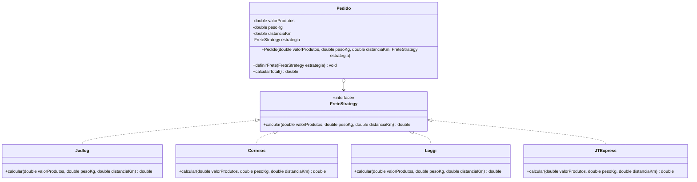

# Diagrama UML - Strategy

```mermaid
classDiagram
    class Pedido {
        -double valorProdutos
        -double pesoKg
        -double distanciaKm
        -FreteStrategy estrategia
        +Pedido(double valorProdutos, double pesoKg, double distanciaKm, FreteStrategy estrategia)
        +definirFrete(FreteStrategy estrategia) void
        +calcularTotal() double
    }

    class FreteStrategy {
        <<interface>>
        +calcular(double valorProdutos, double pesoKg, double distanciaKm) double
    }

    class Jadlog {
        +calcular(double valorProdutos, double pesoKg, double distanciaKm) double
    }

    class Correios {
        +calcular(double valorProdutos, double pesoKg, double distanciaKm) double
    }

    class Loggi {
        +calcular(double valorProdutos, double pesoKg, double distanciaKm) double
    }

    class JTExpress {
        +calcular(double valorProdutos, double pesoKg, double distanciaKm) double
    }

    Pedido o--> FreteStrategy
    FreteStrategy <|.. Jadlog
    FreteStrategy <|.. Correios
    FreteStrategy <|.. Loggi
    FreteStrategy <|.. JTExpress
```
