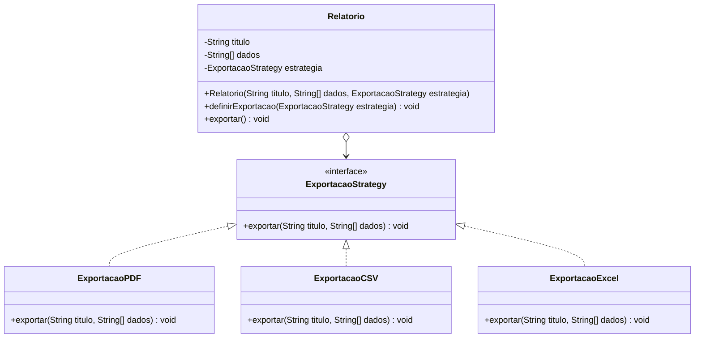

# Diagrama UML - Strategy

```mermaid
classDiagram
    class Relatorio {
        -String titulo
        -String[] dados
        -ExportacaoStrategy estrategia
        +Relatorio(String titulo, String[] dados, ExportacaoStrategy estrategia)
        +definirExportacao(ExportacaoStrategy estrategia) void
        +exportar() void
    }

    class ExportacaoStrategy {
        <<interface>>
        +exportar(String titulo, String[] dados) void
    }

    class ExportacaoPDF {
        +exportar(String titulo, String[] dados) void
    }

    class ExportacaoCSV {
        +exportar(String titulo, String[] dados) void
    }

    class ExportacaoExcel {
        +exportar(String titulo, String[] dados) void
    }

    Relatorio o--> ExportacaoStrategy
    ExportacaoStrategy <|.. ExportacaoPDF
    ExportacaoStrategy <|.. ExportacaoCSV
    ExportacaoStrategy <|.. ExportacaoExcel
```
