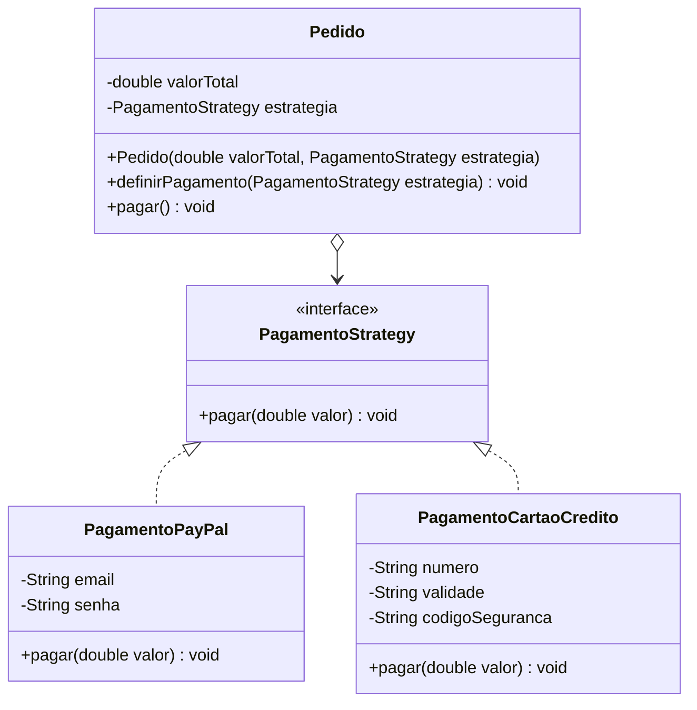

# Diagrama UML - Strategy

```mermaid
classDiagram
    class Pedido {
        -double valorTotal
        -PagamentoStrategy estrategia
        +Pedido(double valorTotal, PagamentoStrategy estrategia)
        +definirPagamento(PagamentoStrategy estrategia) void
        +pagar() void
    }

    class PagamentoStrategy {
        <<interface>>
        +pagar(double valor) void
    }

    class PagamentoPayPal {
        -String email
        -String senha
        +pagar(double valor) void
    }

    class PagamentoCartaoCredito {
        -String numero
        -String validade
        -String codigoSeguranca
        +pagar(double valor) void
    }

    Pedido o--> PagamentoStrategy
    PagamentoStrategy <|.. PagamentoPayPal
    PagamentoStrategy <|.. PagamentoCartaoCredito
```
