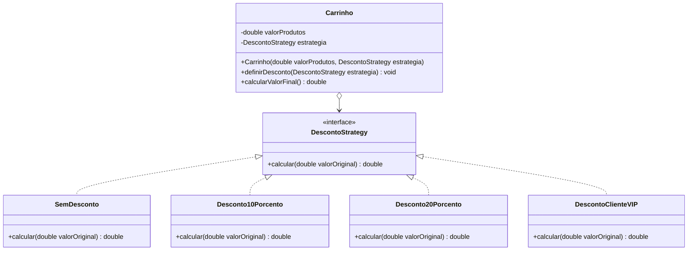

# Diagrama UML - Strategy

```mermaid
classDiagram
    class Carrinho {
        -double valorProdutos
        -DescontoStrategy estrategia
        +Carrinho(double valorProdutos, DescontoStrategy estrategia)
        +definirDesconto(DescontoStrategy estrategia) void
        +calcularValorFinal() double
    }

    class DescontoStrategy {
        <<interface>>
        +calcular(double valorOriginal) double
    }

    class SemDesconto {
        +calcular(double valorOriginal) double
    }

    class Desconto10Porcento {
        +calcular(double valorOriginal) double
    }

    class Desconto20Porcento {
        +calcular(double valorOriginal) double
    }

    class DescontoClienteVIP {
        +calcular(double valorOriginal) double
    }

    Carrinho o--> DescontoStrategy
    DescontoStrategy <|.. SemDesconto
    DescontoStrategy <|.. Desconto10Porcento
    DescontoStrategy <|.. Desconto20Porcento
    DescontoStrategy <|.. DescontoClienteVIP
```
