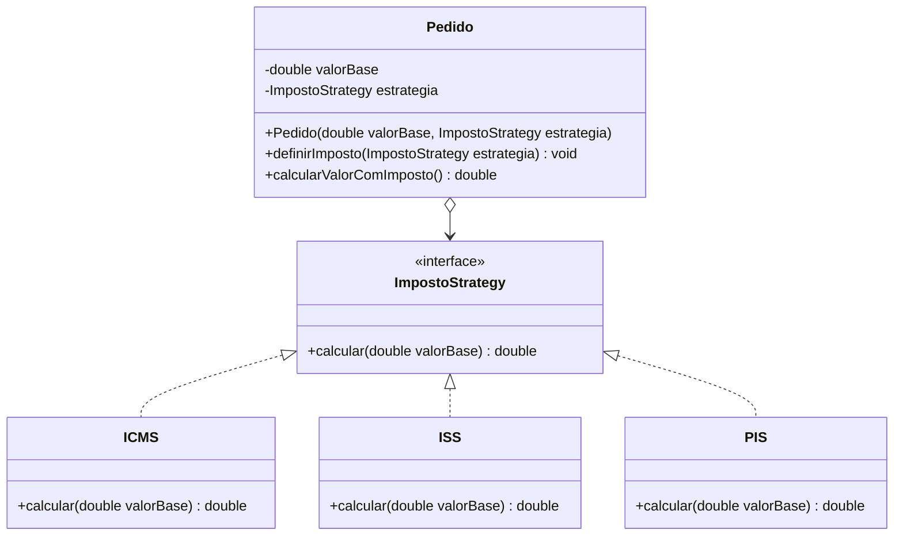

# Diagrama UML - Strategy

```mermaid
classDiagram
    class Pedido {
        -double valorBase
        -ImpostoStrategy estrategia
        +Pedido(double valorBase, ImpostoStrategy estrategia)
        +definirImposto(ImpostoStrategy estrategia) void
        +calcularValorComImposto() double
    }

    class ImpostoStrategy {
        <<interface>>
        +calcular(double valorBase) double
    }

    class ICMS {
        +calcular(double valorBase) double
    }

    class ISS {
        +calcular(double valorBase) double
    }

    class PIS {
        +calcular(double valorBase) double
    }

    Pedido o--> ImpostoStrategy
    ImpostoStrategy <|.. ICMS
    ImpostoStrategy <|.. ISS
    ImpostoStrategy <|.. PIS
```
