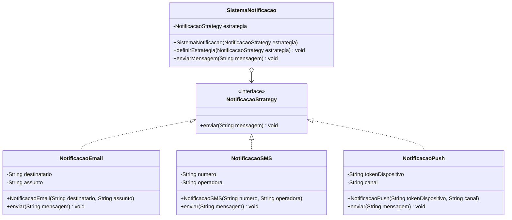

# Diagrama UML - Strategy

```mermaid
classDiagram
    class SistemaNotificacao {
        -NotificacaoStrategy estrategia
        +SistemaNotificacao(NotificacaoStrategy estrategia)
        +definirEstrategia(NotificacaoStrategy estrategia) void
        +enviarMensagem(String mensagem) void
    }

    class NotificacaoStrategy {
        <<interface>>
        +enviar(String mensagem) void
    }

    class NotificacaoEmail {
        -String destinatario
        -String assunto
        +NotificacaoEmail(String destinatario, String assunto)
        +enviar(String mensagem) void
    }

    class NotificacaoSMS {
        -String numero
        -String operadora
        +NotificacaoSMS(String numero, String operadora)
        +enviar(String mensagem) void
    }

    class NotificacaoPush {
        -String tokenDispositivo
        -String canal
        +NotificacaoPush(String tokenDispositivo, String canal)
        +enviar(String mensagem) void
    }

    SistemaNotificacao o--> NotificacaoStrategy
    NotificacaoStrategy <|.. NotificacaoEmail
    NotificacaoStrategy <|.. NotificacaoSMS
    NotificacaoStrategy <|.. NotificacaoPush
```
