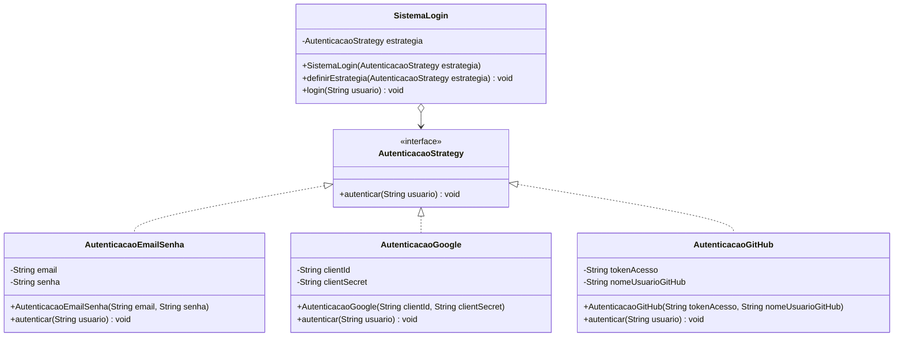

# Diagrama UML - Strategy

```mermaid
classDiagram
    class SistemaLogin {
        -AutenticacaoStrategy estrategia
        +SistemaLogin(AutenticacaoStrategy estrategia)
        +definirEstrategia(AutenticacaoStrategy estrategia) void
        +login(String usuario) void
    }

    class AutenticacaoStrategy {
        <<interface>>
        +autenticar(String usuario) void
    }

    class AutenticacaoEmailSenha {
        -String email
        -String senha
        +AutenticacaoEmailSenha(String email, String senha)
        +autenticar(String usuario) void
    }

    class AutenticacaoGoogle {
        -String clientId
        -String clientSecret
        +AutenticacaoGoogle(String clientId, String clientSecret)
        +autenticar(String usuario) void
    }

    class AutenticacaoGitHub {
        -String tokenAcesso
        -String nomeUsuarioGitHub
        +AutenticacaoGitHub(String tokenAcesso, String nomeUsuarioGitHub)
        +autenticar(String usuario) void
    }

    SistemaLogin o--> AutenticacaoStrategy
    AutenticacaoStrategy <|.. AutenticacaoEmailSenha
    AutenticacaoStrategy <|.. AutenticacaoGoogle
    AutenticacaoStrategy <|.. AutenticacaoGitHub
```
