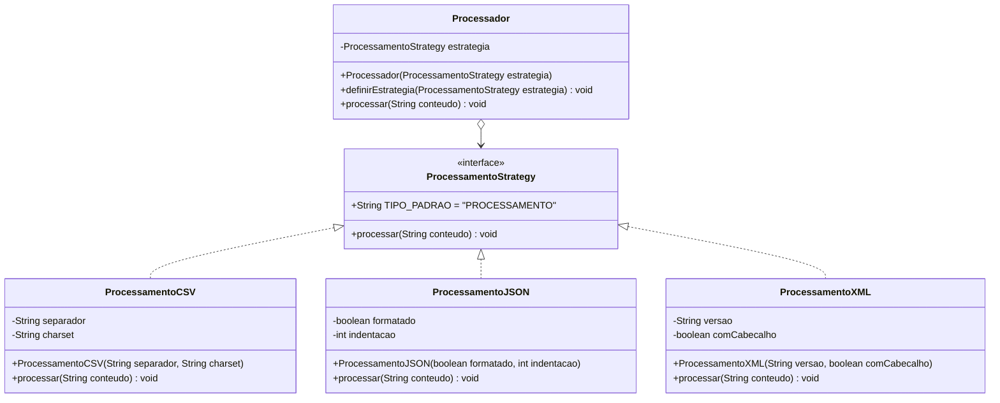

# Diagrama UML - Strategy

```mermaid
classDiagram
    class Processador {
        -ProcessamentoStrategy estrategia
        +Processador(ProcessamentoStrategy estrategia)
        +definirEstrategia(ProcessamentoStrategy estrategia) void
        +processar(String conteudo) void
    }

    class ProcessamentoStrategy {
        <<interface>>
        +String TIPO_PADRAO = "PROCESSAMENTO"
        +processar(String conteudo) void
    }

    class ProcessamentoCSV {
        -String separador
        -String charset
        +ProcessamentoCSV(String separador, String charset)
        +processar(String conteudo) void
    }

    class ProcessamentoJSON {
        -boolean formatado
        -int indentacao
        +ProcessamentoJSON(boolean formatado, int indentacao)
        +processar(String conteudo) void
    }

    class ProcessamentoXML {
        -String versao
        -boolean comCabecalho
        +ProcessamentoXML(String versao, boolean comCabecalho)
        +processar(String conteudo) void
    }

    Processador o--> ProcessamentoStrategy
    ProcessamentoStrategy <|.. ProcessamentoCSV
    ProcessamentoStrategy <|.. ProcessamentoJSON
    ProcessamentoStrategy <|.. ProcessamentoXML
```
