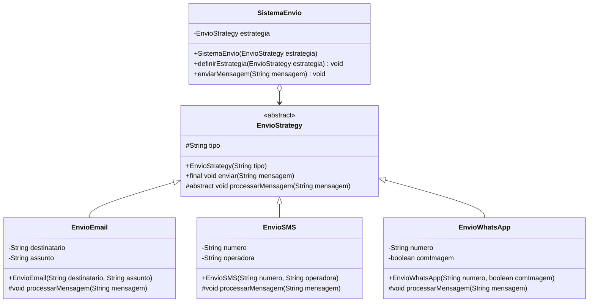

# Diagrama UML - Strategy com abstract class

```mermaid
classDiagram
    class SistemaEnvio {
        -EnvioStrategy estrategia
        +SistemaEnvio(EnvioStrategy estrategia)
        +definirEstrategia(EnvioStrategy estrategia) void
        +enviarMensagem(String mensagem) void
    }

    class EnvioStrategy {
        <<abstract>>
        #String tipo
        +EnvioStrategy(String tipo)
        +final void enviar(String mensagem)
        #abstract void processarMensagem(String mensagem)
    }

    class EnvioEmail {
        -String destinatario
        -String assunto
        +EnvioEmail(String destinatario, String assunto)
        #void processarMensagem(String mensagem)
    }

    class EnvioSMS {
        -String numero
        -String operadora
        +EnvioSMS(String numero, String operadora)
        #void processarMensagem(String mensagem)
    }

    class EnvioWhatsApp {
        -String numero
        -boolean comImagem
        +EnvioWhatsApp(String numero, boolean comImagem)
        #void processarMensagem(String mensagem)
    }

    SistemaEnvio o--> EnvioStrategy
    EnvioStrategy <|-- EnvioEmail
    EnvioStrategy <|-- EnvioSMS
    EnvioStrategy <|-- EnvioWhatsApp
```
