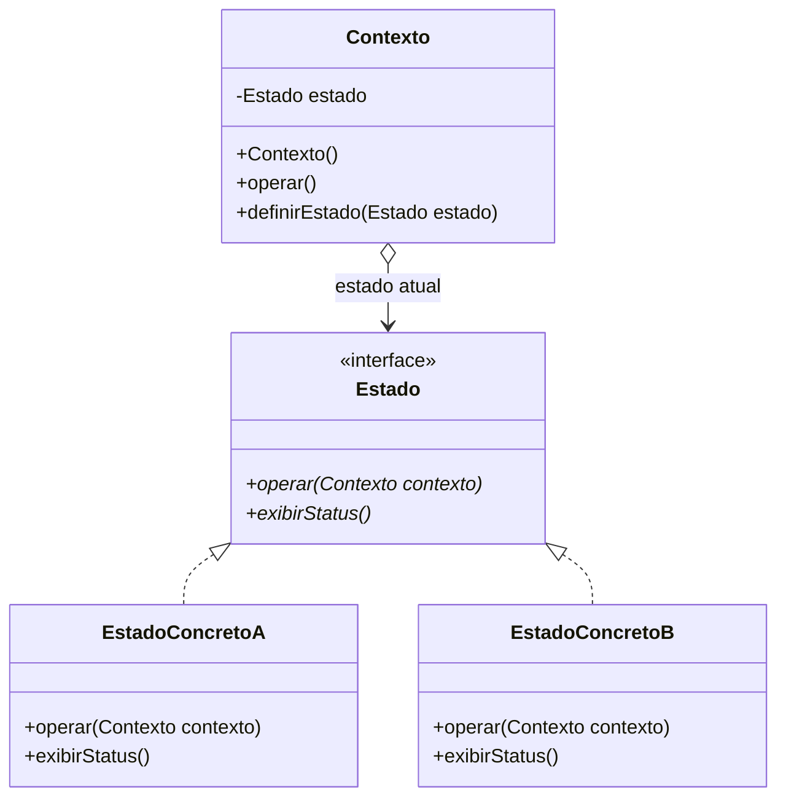
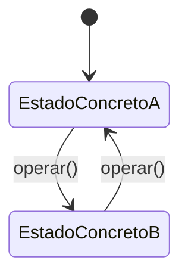

# Diagrama - State

```mermaid
classDiagram
    class Contexto {
        -Estado estado
        +Contexto()
        +operar()
        +definirEstado(Estado estado)
    }

    class Estado {
        <<interface>>
        +operar(Contexto contexto)*
        +exibirStatus()*
    }

    class EstadoConcretoA {
        +operar(Contexto contexto)
        +exibirStatus()
    }

    class EstadoConcretoB {
        +operar(Contexto contexto)
        +exibirStatus()
    }

    Contexto o--> Estado : estado atual
    Estado <|.. EstadoConcretoA
    Estado <|.. EstadoConcretoB
```

## Fluxo de estados

```mermaid
stateDiagram-v2
    [*] --> EstadoConcretoA
    EstadoConcretoA --> EstadoConcretoB : operar()
    EstadoConcretoB --> EstadoConcretoA : operar()
```
