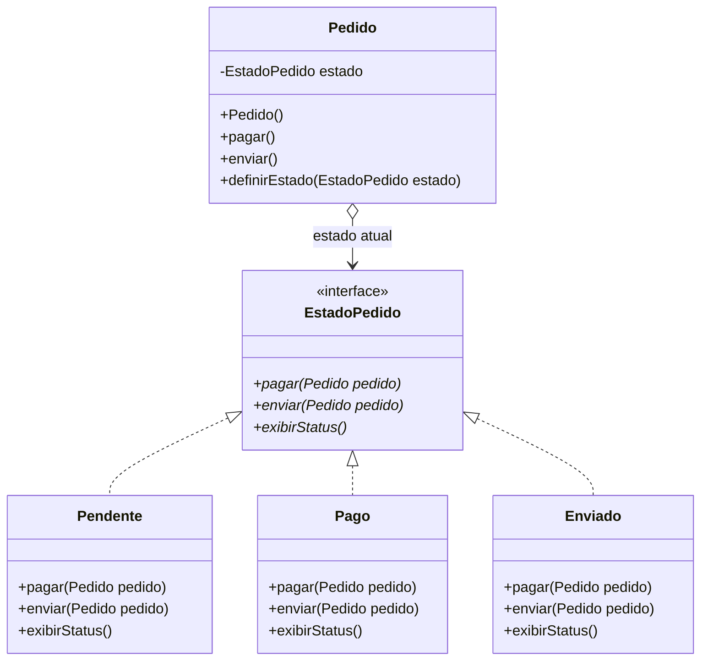
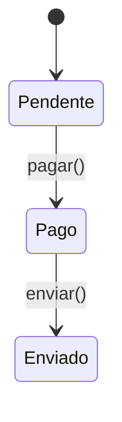

# Diagrama - State: pedido

```mermaid
classDiagram
    class Pedido {
        -EstadoPedido estado
        +Pedido()
        +pagar()
        +enviar()
        +definirEstado(EstadoPedido estado)
    }

    class EstadoPedido {
        <<interface>>
        +pagar(Pedido pedido)*
        +enviar(Pedido pedido)*
        +exibirStatus()*
    }

    class Pendente {
        +pagar(Pedido pedido)
        +enviar(Pedido pedido)
        +exibirStatus()
    }

    class Pago {
        +pagar(Pedido pedido)
        +enviar(Pedido pedido)
        +exibirStatus()
    }

    class Enviado {
        +pagar(Pedido pedido)
        +enviar(Pedido pedido)
        +exibirStatus()
    }

    Pedido o--> EstadoPedido : estado atual
    EstadoPedido <|.. Pendente
    EstadoPedido <|.. Pago
    EstadoPedido <|.. Enviado
```

## Fluxo de estados

```mermaid
stateDiagram-v2
    [*] --> Pendente
    Pendente --> Pago : pagar()
    Pago --> Enviado : enviar()
```
