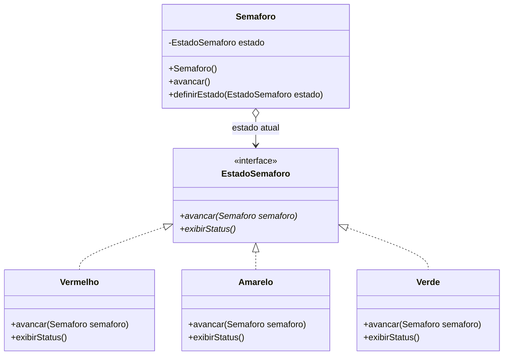
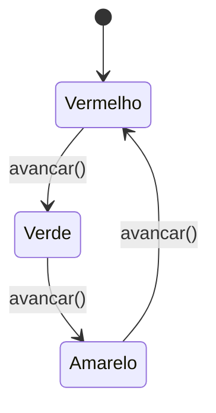

# Diagrama - State: semaforo

```mermaid
classDiagram
    class Semaforo {
        -EstadoSemaforo estado
        +Semaforo()
        +avancar()
        +definirEstado(EstadoSemaforo estado)
    }

    class EstadoSemaforo {
        <<interface>>
        +avancar(Semaforo semaforo)*
        +exibirStatus()*
    }

    class Vermelho {
        +avancar(Semaforo semaforo)
        +exibirStatus()
    }

    class Amarelo {
        +avancar(Semaforo semaforo)
        +exibirStatus()
    }

    class Verde {
        +avancar(Semaforo semaforo)
        +exibirStatus()
    }

    Semaforo o--> EstadoSemaforo : estado atual
    EstadoSemaforo <|.. Vermelho
    EstadoSemaforo <|.. Amarelo
    EstadoSemaforo <|.. Verde
```

## Fluxo de estados

```mermaid
stateDiagram-v2
    [*] --> Vermelho
    Vermelho --> Verde : avancar()
    Verde --> Amarelo : avancar()
    Amarelo --> Vermelho : avancar()
```
