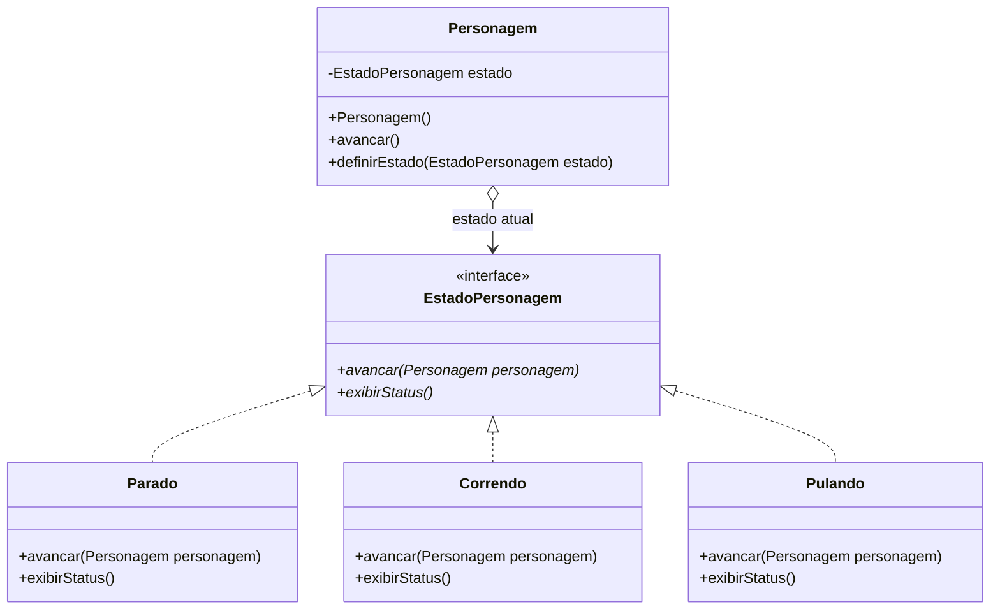
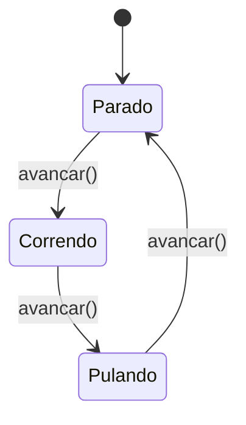

# Diagrama - State: personagem

```mermaid
classDiagram
    class Personagem {
        -EstadoPersonagem estado
        +Personagem()
        +avancar()
        +definirEstado(EstadoPersonagem estado)
    }

    class EstadoPersonagem {
        <<interface>>
        +avancar(Personagem personagem)*
        +exibirStatus()*
    }

    class Parado {
        +avancar(Personagem personagem)
        +exibirStatus()
    }

    class Correndo {
        +avancar(Personagem personagem)
        +exibirStatus()
    }

    class Pulando {
        +avancar(Personagem personagem)
        +exibirStatus()
    }

    Personagem o--> EstadoPersonagem : estado atual
    EstadoPersonagem <|.. Parado
    EstadoPersonagem <|.. Correndo
    EstadoPersonagem <|.. Pulando
```

## Fluxo de estados

```mermaid
stateDiagram-v2
    [*] --> Parado
    Parado --> Correndo : avancar()
    Correndo --> Pulando : avancar()
    Pulando --> Parado : avancar()
```
