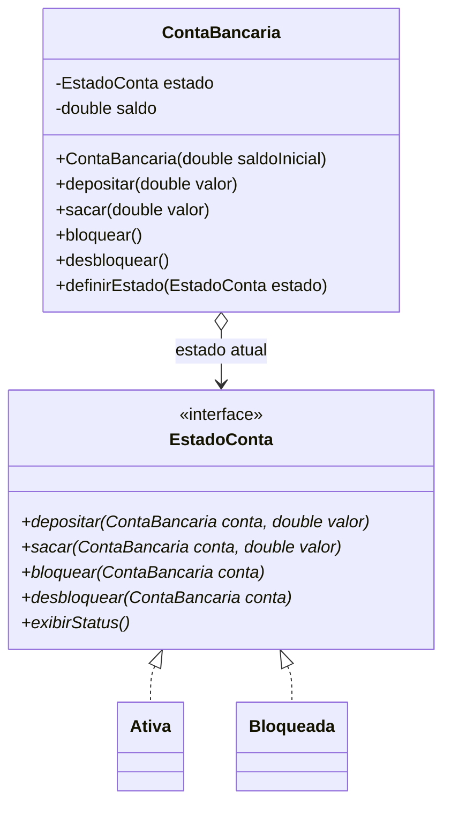
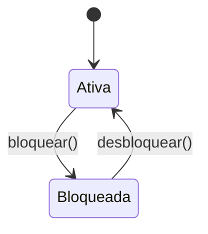

# Diagrama - State: conta bancaria

```mermaid
classDiagram
    class ContaBancaria {
        -EstadoConta estado
        -double saldo
        +ContaBancaria(double saldoInicial)
        +depositar(double valor)
        +sacar(double valor)
        +bloquear()
        +desbloquear()
        +definirEstado(EstadoConta estado)
    }

    class EstadoConta {
        <<interface>>
        +depositar(ContaBancaria conta, double valor)*
        +sacar(ContaBancaria conta, double valor)*
        +bloquear(ContaBancaria conta)*
        +desbloquear(ContaBancaria conta)*
        +exibirStatus()*
    }

    class Ativa
    class Bloqueada

    ContaBancaria o--> EstadoConta : estado atual
    EstadoConta <|.. Ativa
    EstadoConta <|.. Bloqueada
```

## Fluxo de estados

```mermaid
stateDiagram-v2
    [*] --> Ativa
    Ativa --> Bloqueada : bloquear()
    Bloqueada --> Ativa : desbloquear()
```
