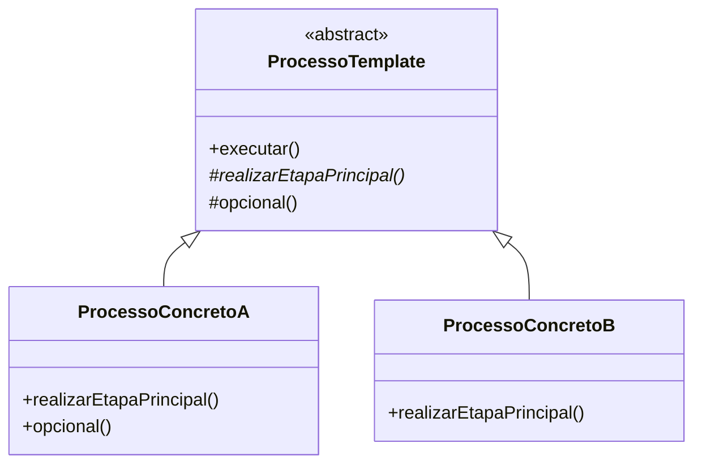
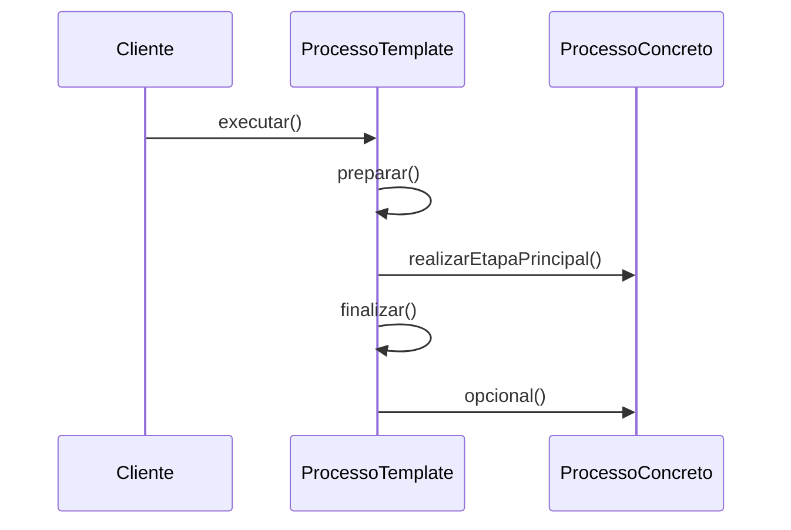

# Diagrama - Template Method

```mermaid
classDiagram
    class ProcessoTemplate {
        <<abstract>>
        +executar()
        #realizarEtapaPrincipal()*
        #opcional()
    }

    class ProcessoConcretoA {
        +realizarEtapaPrincipal()
        +opcional()
    }

    class ProcessoConcretoB {
        +realizarEtapaPrincipal()
    }

    ProcessoTemplate <|-- ProcessoConcretoA
    ProcessoTemplate <|-- ProcessoConcretoB
```

## Fluxo do template method

```mermaid
sequenceDiagram
    participant Cliente
    participant Template as ProcessoTemplate
    participant Concreto as ProcessoConcreto

    Cliente->>Template: executar()
    Template->>Template: preparar()
    Template->>Concreto: realizarEtapaPrincipal()
    Template->>Template: finalizar()
    Template->>Concreto: opcional()
```
