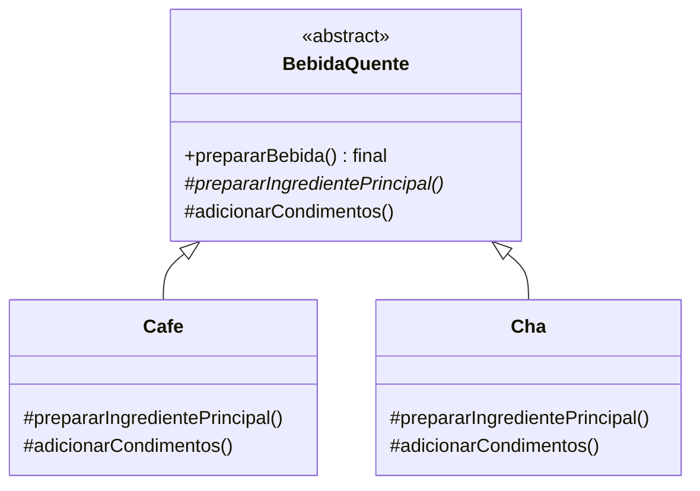

# Diagrama UML

```mermaid
classDiagram
    class BebidaQuente {
        <<abstract>>
        +prepararBebida() final
        #prepararIngredientePrincipal()*
        #adicionarCondimentos()
    }

    class Cafe {
        #prepararIngredientePrincipal()
        #adicionarCondimentos()
    }

    class Cha {
        #prepararIngredientePrincipal()
        #adicionarCondimentos()
    }

    BebidaQuente <|-- Cafe
    BebidaQuente <|-- Cha
```
