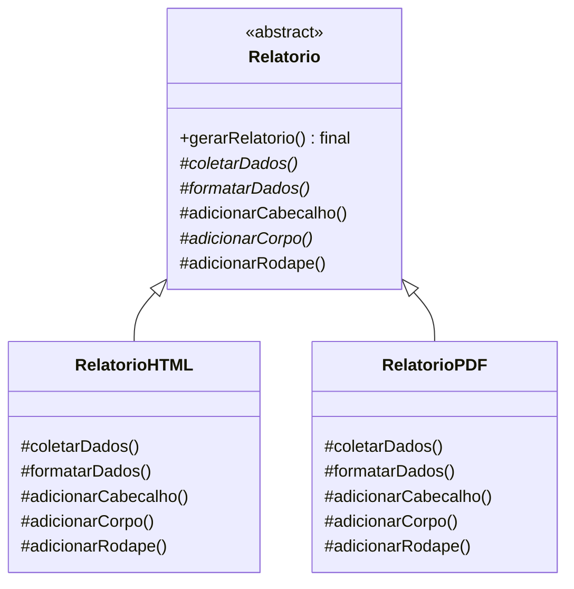

# Diagrama UML

```mermaid
classDiagram
    class Relatorio {
        <<abstract>>
        +gerarRelatorio() final
        #coletarDados()*
        #formatarDados()*
        #adicionarCabecalho()
        #adicionarCorpo()*
        #adicionarRodape()
    }

    class RelatorioHTML {
        #coletarDados()
        #formatarDados()
        #adicionarCabecalho()
        #adicionarCorpo()
        #adicionarRodape()
    }

    class RelatorioPDF {
        #coletarDados()
        #formatarDados()
        #adicionarCabecalho()
        #adicionarCorpo()
        #adicionarRodape()
    }

    Relatorio <|-- RelatorioHTML
    Relatorio <|-- RelatorioPDF
```

`gerarRelatorio` controla o fluxo. Os metodos abstratos sao etapas obrigatorias
e os metodos com implementacao vazia sao hooks opcionais.
