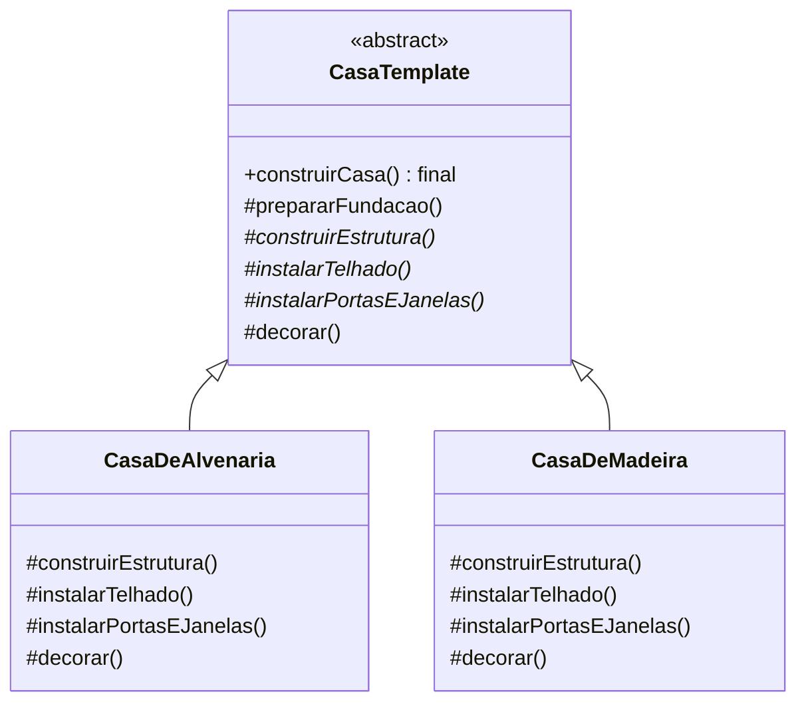

# Diagrama UML

```mermaid
classDiagram
    class CasaTemplate {
        <<abstract>>
        +construirCasa() final
        #prepararFundacao()
        #construirEstrutura()*
        #instalarTelhado()*
        #instalarPortasEJanelas()*
        #decorar()
    }

    class CasaDeAlvenaria {
        #construirEstrutura()
        #instalarTelhado()
        #instalarPortasEJanelas()
        #decorar()
    }

    class CasaDeMadeira {
        #construirEstrutura()
        #instalarTelhado()
        #instalarPortasEJanelas()
        #decorar()
    }

    CasaTemplate <|-- CasaDeAlvenaria
    CasaTemplate <|-- CasaDeMadeira
```

`construirCasa` controla a ordem das etapas. Os metodos abstratos sao etapas
obrigatorias, enquanto `decorar` e um hook opcional.
