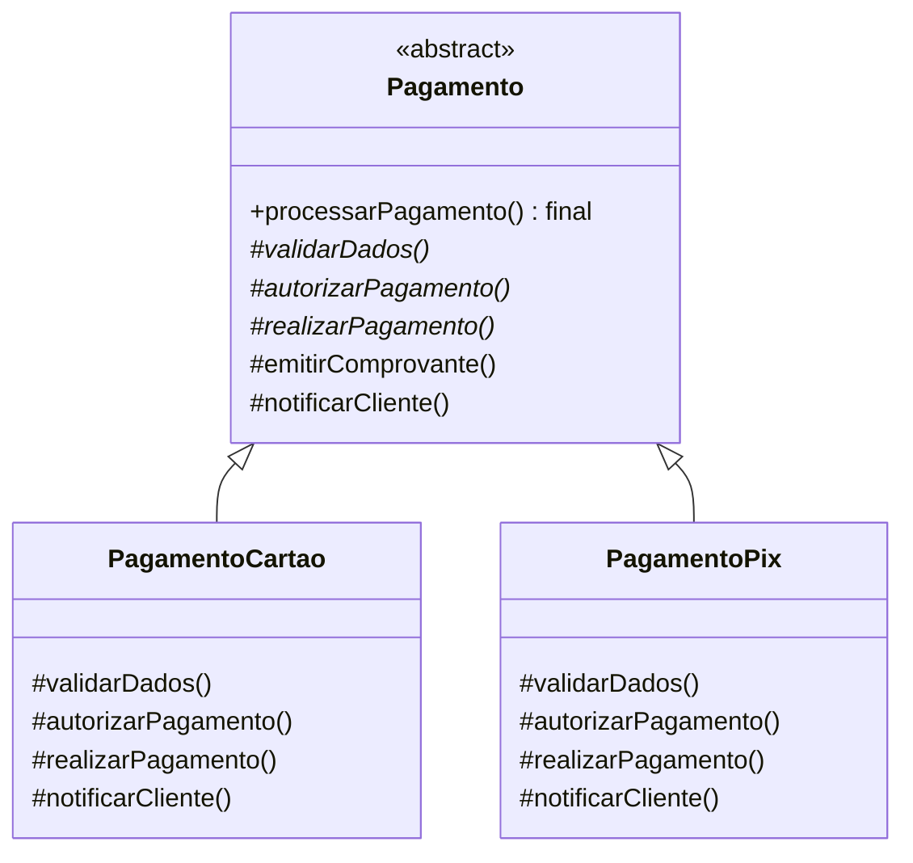

# Diagrama UML

```mermaid
classDiagram
    class Pagamento {
        <<abstract>>
        +processarPagamento() final
        #validarDados()*
        #autorizarPagamento()*
        #realizarPagamento()*
        #emitirComprovante()
        #notificarCliente()
    }

    class PagamentoCartao {
        #validarDados()
        #autorizarPagamento()
        #realizarPagamento()
        #notificarCliente()
    }

    class PagamentoPix {
        #validarDados()
        #autorizarPagamento()
        #realizarPagamento()
        #notificarCliente()
    }

    Pagamento <|-- PagamentoCartao
    Pagamento <|-- PagamentoPix
```

`processarPagamento` controla o fluxo comum. Os tres primeiros metodos sao
etapas obrigatorias, enquanto `notificarCliente` e um hook opcional.
