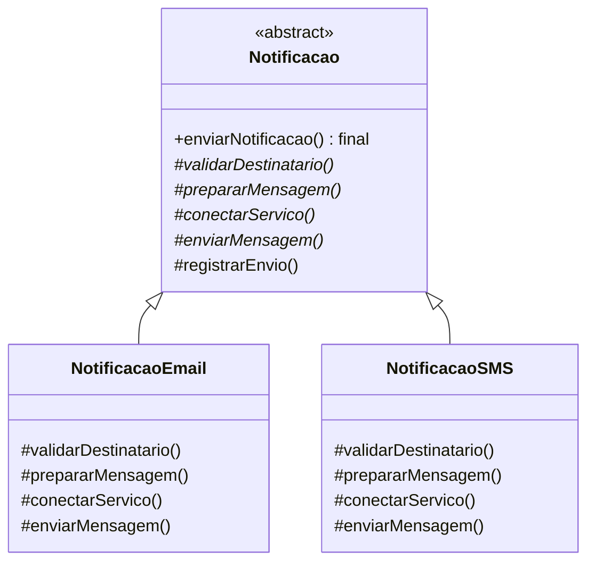

# Diagrama UML

```mermaid
classDiagram
    class Notificacao {
        <<abstract>>
        +enviarNotificacao() final
        #validarDestinatario()*
        #prepararMensagem()*
        #conectarServico()*
        #enviarMensagem()*
        #registrarEnvio()
    }

    class NotificacaoEmail {
        #validarDestinatario()
        #prepararMensagem()
        #conectarServico()
        #enviarMensagem()
    }

    class NotificacaoSMS {
        #validarDestinatario()
        #prepararMensagem()
        #conectarServico()
        #enviarMensagem()
    }

    Notificacao <|-- NotificacaoEmail
    Notificacao <|-- NotificacaoSMS
```

`enviarNotificacao` controla o fluxo comum. Os metodos abstratos sao etapas
obrigatorias e `registrarEnvio` e uma etapa concreta compartilhada.
