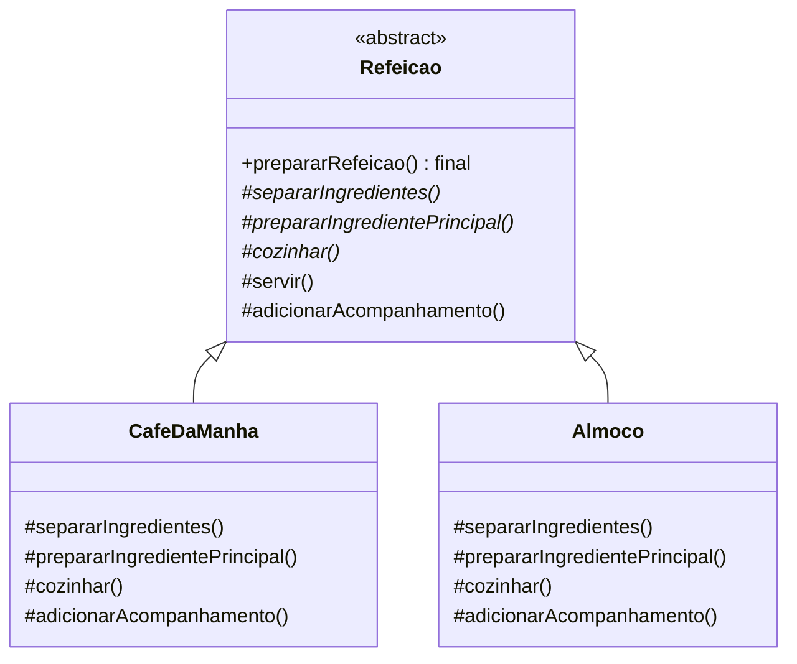

# Diagrama UML

```mermaid
classDiagram
    class Refeicao {
        <<abstract>>
        +prepararRefeicao() final
        #separarIngredientes()*
        #prepararIngredientePrincipal()*
        #cozinhar()*
        #servir()
        #adicionarAcompanhamento()
    }

    class CafeDaManha {
        #separarIngredientes()
        #prepararIngredientePrincipal()
        #cozinhar()
        #adicionarAcompanhamento()
    }

    class Almoco {
        #separarIngredientes()
        #prepararIngredientePrincipal()
        #cozinhar()
        #adicionarAcompanhamento()
    }

    Refeicao <|-- CafeDaManha
    Refeicao <|-- Almoco
```

`prepararRefeicao` controla o fluxo comum. Os tres primeiros metodos sao
etapas obrigatorias, enquanto `adicionarAcompanhamento` e um hook opcional.
