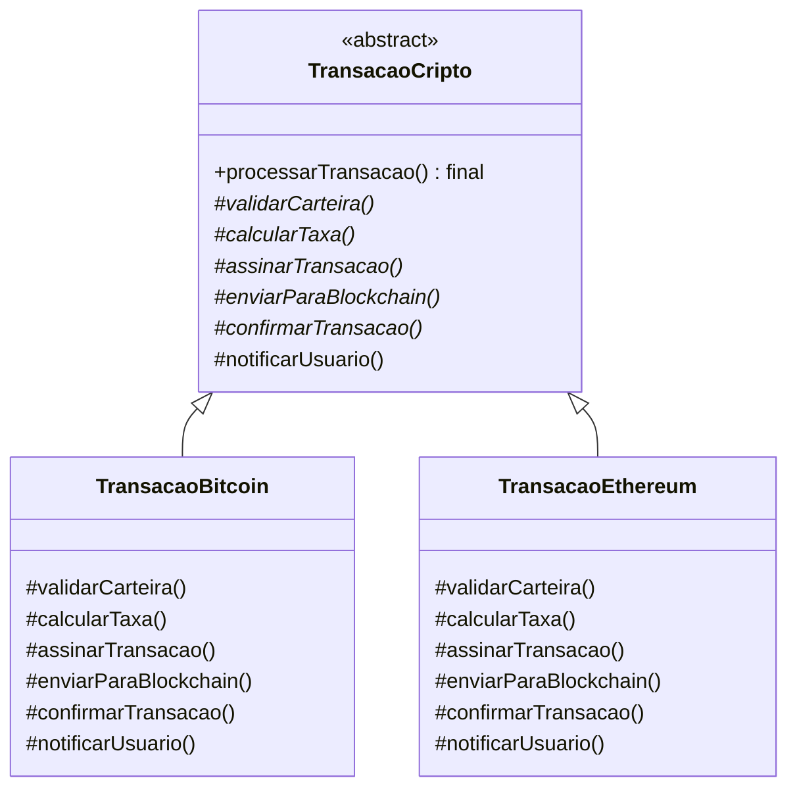

# Diagrama UML

```mermaid
classDiagram
    class TransacaoCripto {
        <<abstract>>
        +processarTransacao() final
        #validarCarteira()*
        #calcularTaxa()*
        #assinarTransacao()*
        #enviarParaBlockchain()*
        #confirmarTransacao()*
        #notificarUsuario()
    }

    class TransacaoBitcoin {
        #validarCarteira()
        #calcularTaxa()
        #assinarTransacao()
        #enviarParaBlockchain()
        #confirmarTransacao()
        #notificarUsuario()
    }

    class TransacaoEthereum {
        #validarCarteira()
        #calcularTaxa()
        #assinarTransacao()
        #enviarParaBlockchain()
        #confirmarTransacao()
        #notificarUsuario()
    }

    TransacaoCripto <|-- TransacaoBitcoin
    TransacaoCripto <|-- TransacaoEthereum
```

`processarTransacao` controla a ordem do fluxo. Os cinco primeiros metodos
sao etapas obrigatorias e `notificarUsuario` e um hook opcional.
