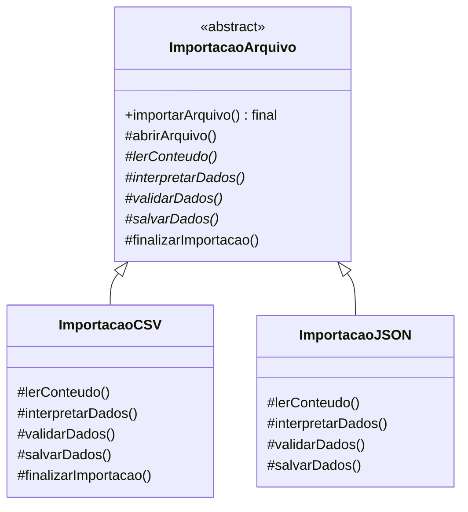

# Diagrama UML

```mermaid
classDiagram
    class ImportacaoArquivo {
        <<abstract>>
        +importarArquivo() final
        #abrirArquivo()
        #lerConteudo()*
        #interpretarDados()*
        #validarDados()*
        #salvarDados()*
        #finalizarImportacao()
    }

    class ImportacaoCSV {
        #lerConteudo()
        #interpretarDados()
        #validarDados()
        #salvarDados()
        #finalizarImportacao()
    }

    class ImportacaoJSON {
        #lerConteudo()
        #interpretarDados()
        #validarDados()
        #salvarDados()
    }

    ImportacaoArquivo <|-- ImportacaoCSV
    ImportacaoArquivo <|-- ImportacaoJSON
```

`importarArquivo` controla o fluxo comum. `abrirArquivo` e uma etapa comum,
os quatro metodos seguintes sao obrigatorios e `finalizarImportacao` e um hook
opcional.
