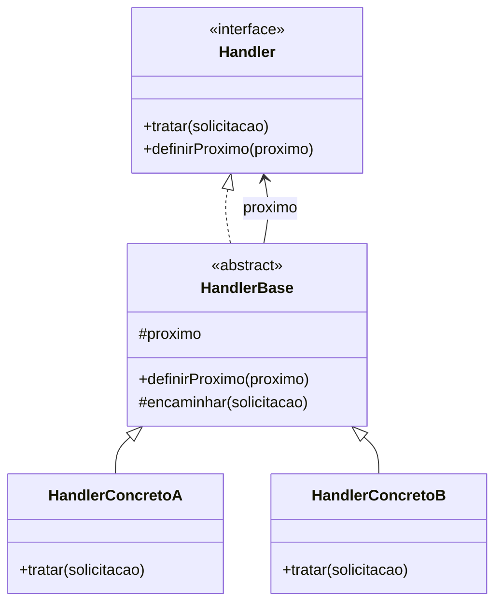
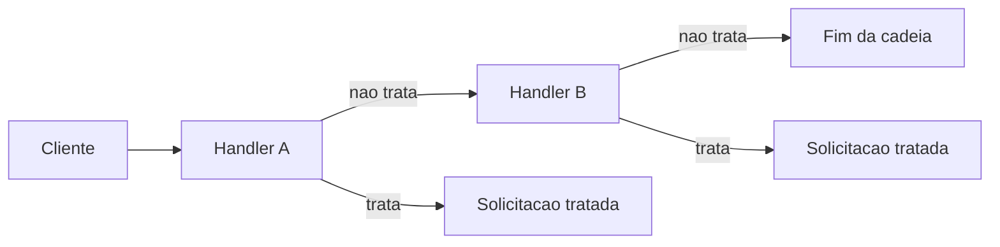

# Diagrama - Chain of Responsibility

```mermaid
classDiagram
    class Handler {
        <<interface>>
        +tratar(solicitacao)
        +definirProximo(proximo)
    }

    class HandlerBase {
        <<abstract>>
        #proximo
        +definirProximo(proximo)
        #encaminhar(solicitacao)
    }

    class HandlerConcretoA {
        +tratar(solicitacao)
    }

    class HandlerConcretoB {
        +tratar(solicitacao)
    }

    Handler <|.. HandlerBase
    HandlerBase <|-- HandlerConcretoA
    HandlerBase <|-- HandlerConcretoB
    HandlerBase --> Handler : proximo
```

## Fluxo da cadeia

```mermaid
flowchart LR
    Cliente --> A[Handler A]
    A -->|nao trata| B[Handler B]
    B -->|nao trata| Fim[Fim da cadeia]
    A -->|trata| ResolvidoA[Solicitacao tratada]
    B -->|trata| ResolvidoB[Solicitacao tratada]
```
