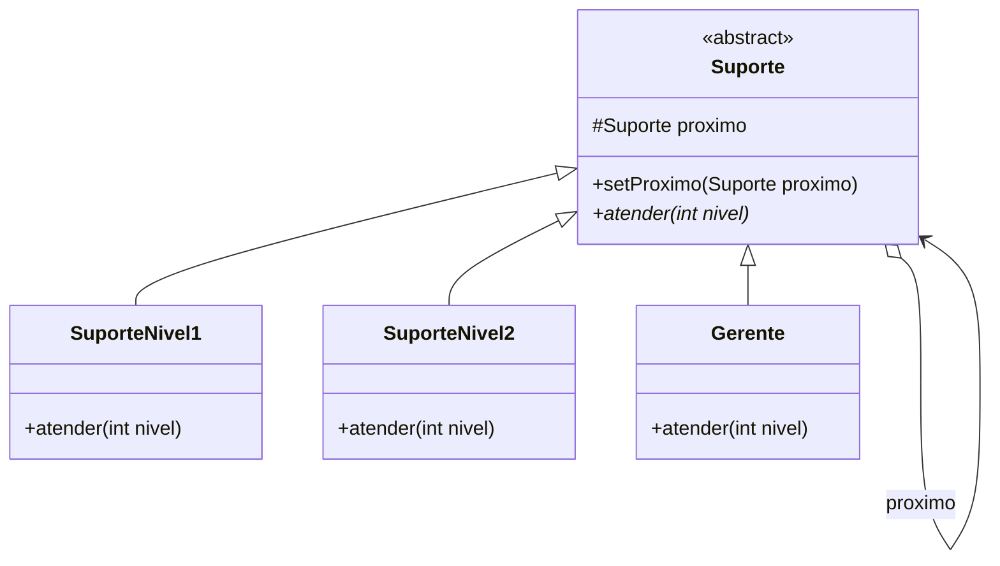

# Diagrama - Chain of Responsibility: suporte tecnico

```mermaid
classDiagram
    class Suporte {
        <<abstract>>
        #Suporte proximo
        +setProximo(Suporte proximo)
        +atender(int nivel)*
    }

    class SuporteNivel1 {
        +atender(int nivel)
    }

    class SuporteNivel2 {
        +atender(int nivel)
    }

    class Gerente {
        +atender(int nivel)
    }

    Suporte o--> Suporte : proximo
    Suporte <|-- SuporteNivel1
    Suporte <|-- SuporteNivel2
    Suporte <|-- Gerente
```
