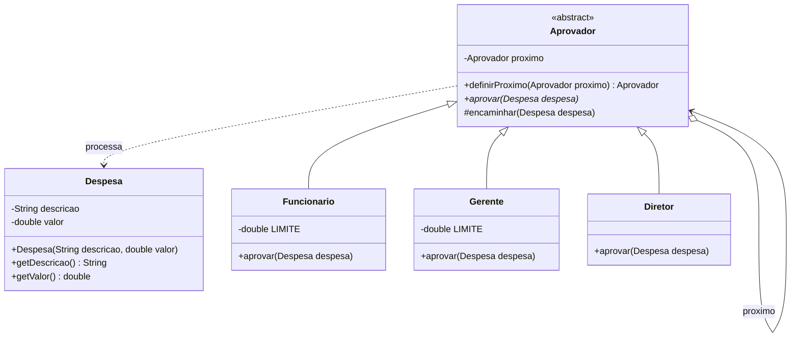

# Diagrama - Chain of Responsibility: aprovacao de despesas

```mermaid
classDiagram
    class Despesa {
        -String descricao
        -double valor
        +Despesa(String descricao, double valor)
        +getDescricao() String
        +getValor() double
    }

    class Aprovador {
        <<abstract>>
        -Aprovador proximo
        +definirProximo(Aprovador proximo) Aprovador
        +aprovar(Despesa despesa)*
        #encaminhar(Despesa despesa)
    }

    class Funcionario {
        -double LIMITE
        +aprovar(Despesa despesa)
    }

    class Gerente {
        -double LIMITE
        +aprovar(Despesa despesa)
    }

    class Diretor {
        +aprovar(Despesa despesa)
    }

    Aprovador o--> Aprovador : proximo
    Aprovador ..> Despesa : processa
    Aprovador <|-- Funcionario
    Aprovador <|-- Gerente
    Aprovador <|-- Diretor
```
