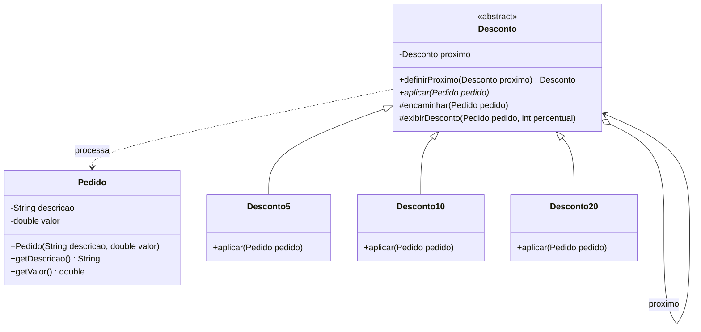
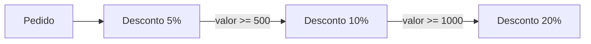

# Diagrama - Chain of Responsibility: sistema de descontos

```mermaid
classDiagram
    class Pedido {
        -String descricao
        -double valor
        +Pedido(String descricao, double valor)
        +getDescricao() String
        +getValor() double
    }

    class Desconto {
        <<abstract>>
        -Desconto proximo
        +definirProximo(Desconto proximo) Desconto
        +aplicar(Pedido pedido)*
        #encaminhar(Pedido pedido)
        #exibirDesconto(Pedido pedido, int percentual)
    }

    class Desconto5 {
        +aplicar(Pedido pedido)
    }

    class Desconto10 {
        +aplicar(Pedido pedido)
    }

    class Desconto20 {
        +aplicar(Pedido pedido)
    }

    Desconto o--> Desconto : proximo
    Desconto ..> Pedido : processa
    Desconto <|-- Desconto5
    Desconto <|-- Desconto10
    Desconto <|-- Desconto20
```

## Fluxo da cadeia

```mermaid
flowchart LR
    Inicio[Pedido] --> D5[Desconto 5%]
    D5 -->|valor >= 500| D10[Desconto 10%]
    D10 -->|valor >= 1000| D20[Desconto 20%]
```
