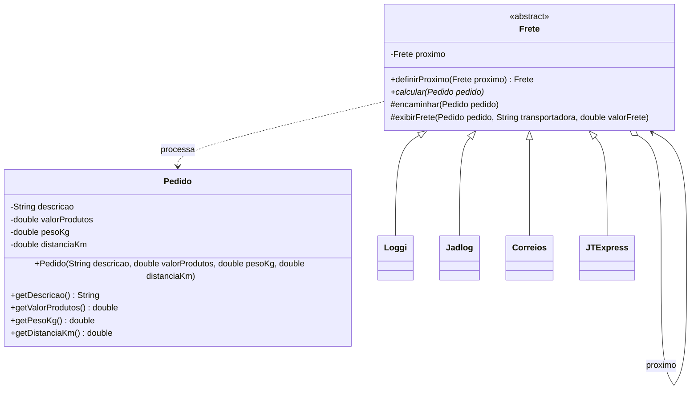
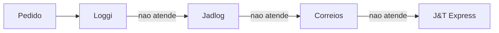

# Diagrama - Chain of Responsibility: sistema de frete

```mermaid
classDiagram
    class Pedido {
        -String descricao
        -double valorProdutos
        -double pesoKg
        -double distanciaKm
        +Pedido(String descricao, double valorProdutos, double pesoKg, double distanciaKm)
        +getDescricao() String
        +getValorProdutos() double
        +getPesoKg() double
        +getDistanciaKm() double
    }

    class Frete {
        <<abstract>>
        -Frete proximo
        +definirProximo(Frete proximo) Frete
        +calcular(Pedido pedido)*
        #encaminhar(Pedido pedido)
        #exibirFrete(Pedido pedido, String transportadora, double valorFrete)
    }

    class Loggi
    class Jadlog
    class Correios
    class JTExpress

    Frete o--> Frete : proximo
    Frete ..> Pedido : processa
    Frete <|-- Loggi
    Frete <|-- Jadlog
    Frete <|-- Correios
    Frete <|-- JTExpress
```

## Fluxo da cadeia

```mermaid
flowchart LR
    Inicio[Pedido] --> L[Loggi]
    L -->|nao atende| J[Jadlog]
    J -->|nao atende| C[Correios]
    C -->|nao atende| JT[J&T Express]
```
