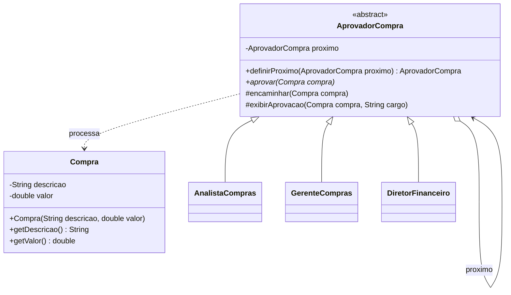
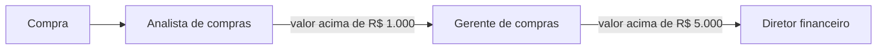

# Diagrama - Chain of Responsibility: aprovacao de compras

```mermaid
classDiagram
    class Compra {
        -String descricao
        -double valor
        +Compra(String descricao, double valor)
        +getDescricao() String
        +getValor() double
    }

    class AprovadorCompra {
        <<abstract>>
        -AprovadorCompra proximo
        +definirProximo(AprovadorCompra proximo) AprovadorCompra
        +aprovar(Compra compra)*
        #encaminhar(Compra compra)
        #exibirAprovacao(Compra compra, String cargo)
    }

    class AnalistaCompras
    class GerenteCompras
    class DiretorFinanceiro

    AprovadorCompra o--> AprovadorCompra : proximo
    AprovadorCompra ..> Compra : processa
    AprovadorCompra <|-- AnalistaCompras
    AprovadorCompra <|-- GerenteCompras
    AprovadorCompra <|-- DiretorFinanceiro
```

## Fluxo da cadeia

```mermaid
flowchart LR
    Inicio[Compra] --> A[Analista de compras]
    A -->|valor acima de R$ 1.000| G[Gerente de compras]
    G -->|valor acima de R$ 5.000| D[Diretor financeiro]
```
