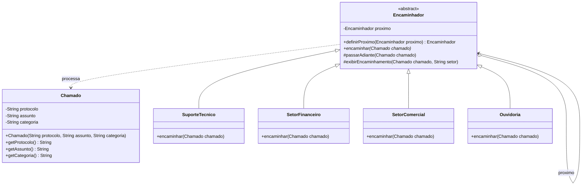
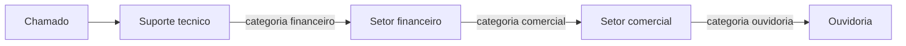

# Diagrama - Chain of Responsibility: encaminhamento de chamados

```mermaid
classDiagram
    class Chamado {
        -String protocolo
        -String assunto
        -String categoria
        +Chamado(String protocolo, String assunto, String categoria)
        +getProtocolo() String
        +getAssunto() String
        +getCategoria() String
    }

    class Encaminhador {
        <<abstract>>
        -Encaminhador proximo
        +definirProximo(Encaminhador proximo) Encaminhador
        +encaminhar(Chamado chamado)*
        #passarAdiante(Chamado chamado)
        #exibirEncaminhamento(Chamado chamado, String setor)
    }

    class SuporteTecnico {
        +encaminhar(Chamado chamado)
    }

    class SetorFinanceiro {
        +encaminhar(Chamado chamado)
    }

    class SetorComercial {
        +encaminhar(Chamado chamado)
    }

    class Ouvidoria {
        +encaminhar(Chamado chamado)
    }

    Encaminhador o--> Encaminhador : proximo
    Encaminhador ..> Chamado : processa
    Encaminhador <|-- SuporteTecnico
    Encaminhador <|-- SetorFinanceiro
    Encaminhador <|-- SetorComercial
    Encaminhador <|-- Ouvidoria
```

## Fluxo da cadeia

```mermaid
flowchart LR
    Inicio[Chamado] --> T[Suporte tecnico]
    T -->|categoria financeiro| F[Setor financeiro]
    F -->|categoria comercial| C[Setor comercial]
    C -->|categoria ouvidoria| O[Ouvidoria]
```
