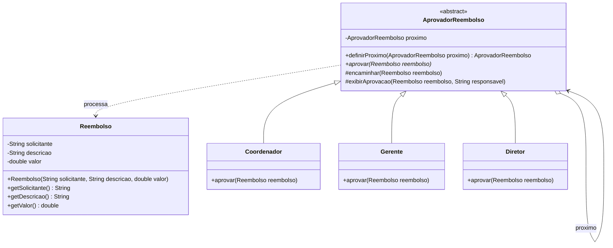
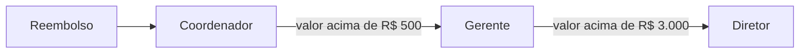

# Diagrama - Chain of Responsibility: solicitacao de reembolso

```mermaid
classDiagram
    class Reembolso {
        -String solicitante
        -String descricao
        -double valor
        +Reembolso(String solicitante, String descricao, double valor)
        +getSolicitante() String
        +getDescricao() String
        +getValor() double
    }

    class AprovadorReembolso {
        <<abstract>>
        -AprovadorReembolso proximo
        +definirProximo(AprovadorReembolso proximo) AprovadorReembolso
        +aprovar(Reembolso reembolso)*
        #encaminhar(Reembolso reembolso)
        #exibirAprovacao(Reembolso reembolso, String responsavel)
    }

    class Coordenador {
        +aprovar(Reembolso reembolso)
    }

    class Gerente {
        +aprovar(Reembolso reembolso)
    }

    class Diretor {
        +aprovar(Reembolso reembolso)
    }

    AprovadorReembolso o--> AprovadorReembolso : proximo
    AprovadorReembolso ..> Reembolso : processa
    AprovadorReembolso <|-- Coordenador
    AprovadorReembolso <|-- Gerente
    AprovadorReembolso <|-- Diretor
```

## Fluxo da cadeia

```mermaid
flowchart LR
    Inicio[Reembolso] --> C[Coordenador]
    C -->|valor acima de R$ 500| G[Gerente]
    G -->|valor acima de R$ 3.000| D[Diretor]
```
