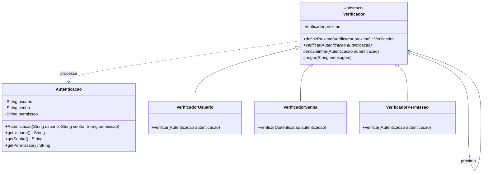
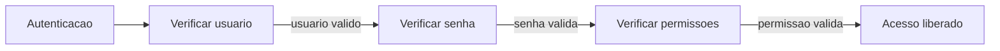

# Diagrama - Chain of Responsibility: sistema de autenticacao

```mermaid
classDiagram
    class Autenticacao {
        -String usuario
        -String senha
        -String permissao
        +Autenticacao(String usuario, String senha, String permissao)
        +getUsuario() String
        +getSenha() String
        +getPermissao() String
    }

    class Verificador {
        <<abstract>>
        -Verificador proximo
        +definirProximo(Verificador proximo) Verificador
        +verificar(Autenticacao autenticacao)*
        #encaminhar(Autenticacao autenticacao)
        #negar(String mensagem)
    }

    class VerificadorUsuario {
        +verificar(Autenticacao autenticacao)
    }

    class VerificadorSenha {
        +verificar(Autenticacao autenticacao)
    }

    class VerificadorPermissao {
        +verificar(Autenticacao autenticacao)
    }

    Verificador o--> Verificador : proximo
    Verificador ..> Autenticacao : processa
    Verificador <|-- VerificadorUsuario
    Verificador <|-- VerificadorSenha
    Verificador <|-- VerificadorPermissao
```

## Fluxo da cadeia

```mermaid
flowchart LR
    Inicio[Autenticacao] --> U[Verificar usuario]
    U -->|usuario valido| S[Verificar senha]
    S -->|senha valida| P[Verificar permissoes]
    P -->|permissao valida| F[Acesso liberado]
```
