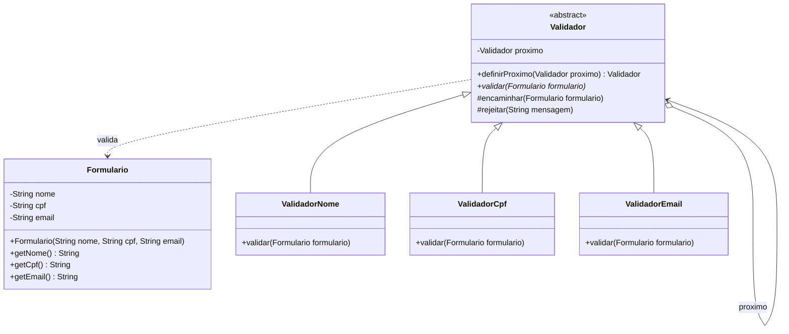
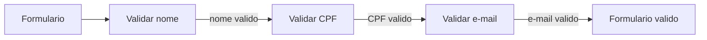

# Diagrama - Chain of Responsibility: validacao de formularios

```mermaid
classDiagram
    class Formulario {
        -String nome
        -String cpf
        -String email
        +Formulario(String nome, String cpf, String email)
        +getNome() String
        +getCpf() String
        +getEmail() String
    }

    class Validador {
        <<abstract>>
        -Validador proximo
        +definirProximo(Validador proximo) Validador
        +validar(Formulario formulario)*
        #encaminhar(Formulario formulario)
        #rejeitar(String mensagem)
    }

    class ValidadorNome {
        +validar(Formulario formulario)
    }

    class ValidadorCpf {
        +validar(Formulario formulario)
    }

    class ValidadorEmail {
        +validar(Formulario formulario)
    }

    Validador o--> Validador : proximo
    Validador ..> Formulario : valida
    Validador <|-- ValidadorNome
    Validador <|-- ValidadorCpf
    Validador <|-- ValidadorEmail
```

## Fluxo da cadeia

```mermaid
flowchart LR
    Inicio[Formulario] --> N[Validar nome]
    N -->|nome valido| C[Validar CPF]
    C -->|CPF valido| E[Validar e-mail]
    E -->|e-mail valido| F[Formulario valido]
```
