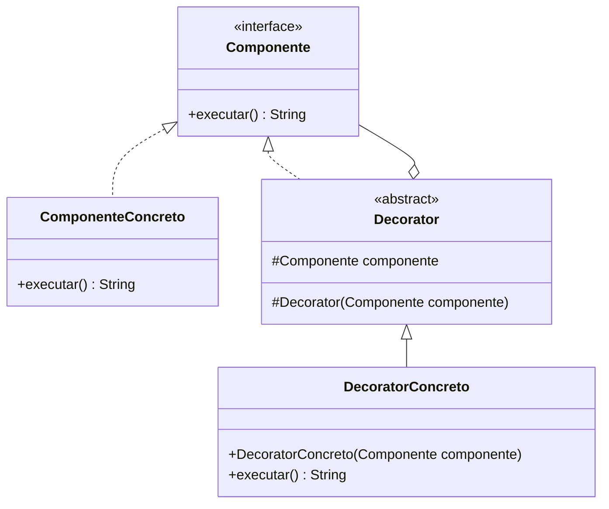

# Diagrama - Estrutura base do Decorator

```mermaid
classDiagram
    class Componente {
        <<interface>>
        +executar() String
    }

    class ComponenteConcreto {
        +executar() String
    }

    class Decorator {
        <<abstract>>
        #Componente componente
        #Decorator(Componente componente)
    }

    class DecoratorConcreto {
        +DecoratorConcreto(Componente componente)
        +executar() String
    }

    Componente <|.. ComponenteConcreto
    Componente <|.. Decorator
    Decorator o-- Componente
    Decorator <|-- DecoratorConcreto
```
