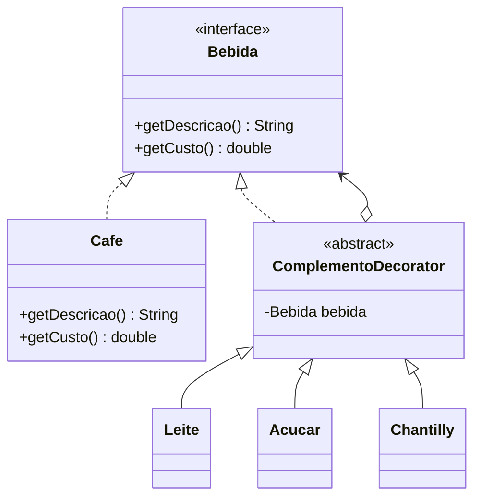

# Diagrama - Decorator: cafe

```mermaid
classDiagram
    class Bebida {
        <<interface>>
        +getDescricao() String
        +getCusto() double
    }

    class Cafe {
        +getDescricao() String
        +getCusto() double
    }

    class ComplementoDecorator {
        <<abstract>>
        -Bebida bebida
    }

    class Leite
    class Acucar
    class Chantilly

    Bebida <|.. Cafe
    Bebida <|.. ComplementoDecorator
    ComplementoDecorator o--> Bebida
    ComplementoDecorator <|-- Leite
    ComplementoDecorator <|-- Acucar
    ComplementoDecorator <|-- Chantilly
```
