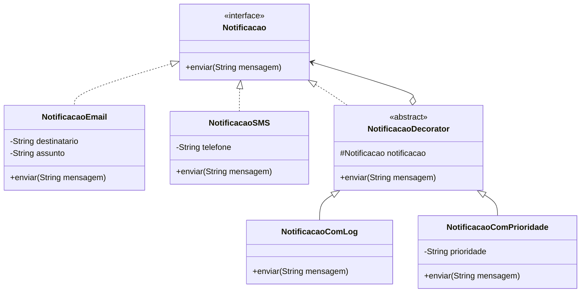

# Diagrama - Decorator: notificacao

```mermaid
classDiagram
    class Notificacao {
        <<interface>>
        +enviar(String mensagem)
    }

    class NotificacaoEmail {
        -String destinatario
        -String assunto
        +enviar(String mensagem)
    }

    class NotificacaoSMS {
        -String telefone
        +enviar(String mensagem)
    }

    class NotificacaoDecorator {
        <<abstract>>
        #Notificacao notificacao
        +enviar(String mensagem)
    }

    class NotificacaoComLog {
        +enviar(String mensagem)
    }

    class NotificacaoComPrioridade {
        -String prioridade
        +enviar(String mensagem)
    }

    Notificacao <|.. NotificacaoEmail
    Notificacao <|.. NotificacaoSMS
    Notificacao <|.. NotificacaoDecorator
    NotificacaoDecorator o--> Notificacao
    NotificacaoDecorator <|-- NotificacaoComLog
    NotificacaoDecorator <|-- NotificacaoComPrioridade
```
