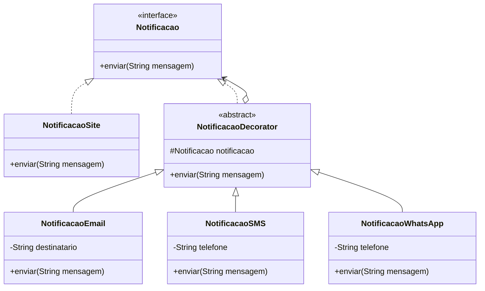

# Diagrama - Decorator: canais de notificacao combinaveis

```mermaid
classDiagram
    class Notificacao {
        <<interface>>
        +enviar(String mensagem)
    }

    class NotificacaoSite {
        +enviar(String mensagem)
    }

    class NotificacaoDecorator {
        <<abstract>>
        #Notificacao notificacao
        +enviar(String mensagem)
    }

    class NotificacaoEmail {
        -String destinatario
        +enviar(String mensagem)
    }

    class NotificacaoSMS {
        -String telefone
        +enviar(String mensagem)
    }

    class NotificacaoWhatsApp {
        -String telefone
        +enviar(String mensagem)
    }

    Notificacao <|.. NotificacaoSite
    Notificacao <|.. NotificacaoDecorator
    NotificacaoDecorator o--> Notificacao
    NotificacaoDecorator <|-- NotificacaoEmail
    NotificacaoDecorator <|-- NotificacaoSMS
    NotificacaoDecorator <|-- NotificacaoWhatsApp
```
