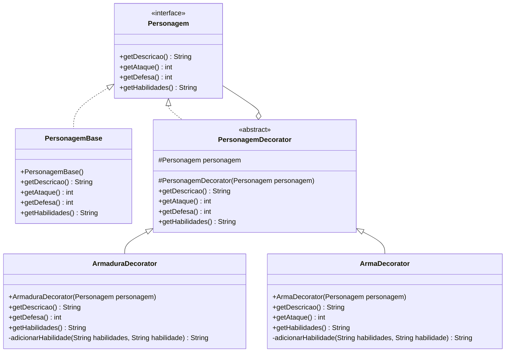

# Diagrama - Decorator: personagem de jogo

```mermaid
classDiagram
    class Personagem {
        <<interface>>
        +getDescricao() String
        +getAtaque() int
        +getDefesa() int
        +getHabilidades() String
    }

    class PersonagemBase {
        +PersonagemBase()
        +getDescricao() String
        +getAtaque() int
        +getDefesa() int
        +getHabilidades() String
    }

    class PersonagemDecorator {
        <<abstract>>
        #Personagem personagem
        #PersonagemDecorator(Personagem personagem)
        +getDescricao() String
        +getAtaque() int
        +getDefesa() int
        +getHabilidades() String
    }

    class ArmaduraDecorator {
        +ArmaduraDecorator(Personagem personagem)
        +getDescricao() String
        +getDefesa() int
        +getHabilidades() String
        -adicionarHabilidade(String habilidades, String habilidade) String
    }

    class ArmaDecorator {
        +ArmaDecorator(Personagem personagem)
        +getDescricao() String
        +getAtaque() int
        +getHabilidades() String
        -adicionarHabilidade(String habilidades, String habilidade) String
    }

    Personagem <|.. PersonagemBase
    Personagem <|.. PersonagemDecorator
    PersonagemDecorator o-- Personagem
    PersonagemDecorator <|-- ArmaduraDecorator
    PersonagemDecorator <|-- ArmaDecorator
```
