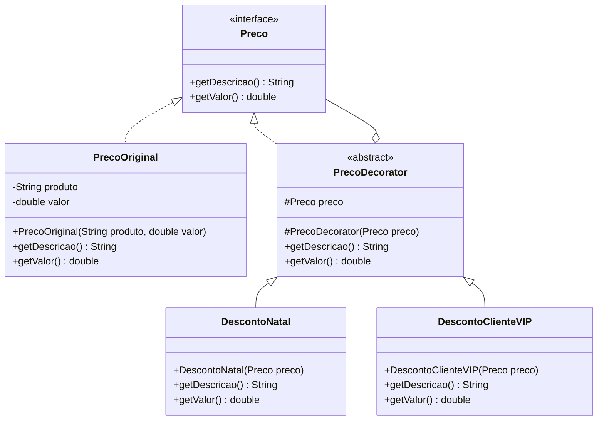

# Diagrama - Decorator: sistema de descontos

```mermaid
classDiagram
    class Preco {
        <<interface>>
        +getDescricao() String
        +getValor() double
    }

    class PrecoOriginal {
        -String produto
        -double valor
        +PrecoOriginal(String produto, double valor)
        +getDescricao() String
        +getValor() double
    }

    class PrecoDecorator {
        <<abstract>>
        #Preco preco
        #PrecoDecorator(Preco preco)
        +getDescricao() String
        +getValor() double
    }

    class DescontoNatal {
        +DescontoNatal(Preco preco)
        +getDescricao() String
        +getValor() double
    }

    class DescontoClienteVIP {
        +DescontoClienteVIP(Preco preco)
        +getDescricao() String
        +getValor() double
    }

    Preco <|.. PrecoOriginal
    Preco <|.. PrecoDecorator
    PrecoDecorator o-- Preco
    PrecoDecorator <|-- DescontoNatal
    PrecoDecorator <|-- DescontoClienteVIP
```
