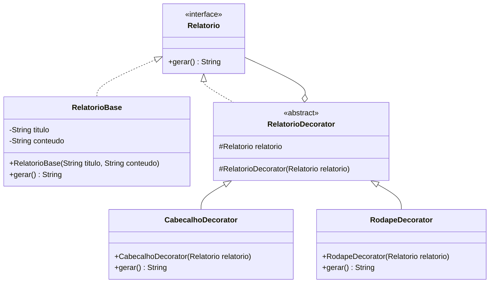

# Diagrama - Decorator: relatorio formatado

```mermaid
classDiagram
    class Relatorio {
        <<interface>>
        +gerar() String
    }

    class RelatorioBase {
        -String titulo
        -String conteudo
        +RelatorioBase(String titulo, String conteudo)
        +gerar() String
    }

    class RelatorioDecorator {
        <<abstract>>
        #Relatorio relatorio
        #RelatorioDecorator(Relatorio relatorio)
    }

    class CabecalhoDecorator {
        +CabecalhoDecorator(Relatorio relatorio)
        +gerar() String
    }

    class RodapeDecorator {
        +RodapeDecorator(Relatorio relatorio)
        +gerar() String
    }

    Relatorio <|.. RelatorioBase
    Relatorio <|.. RelatorioDecorator
    RelatorioDecorator o-- Relatorio
    RelatorioDecorator <|-- CabecalhoDecorator
    RelatorioDecorator <|-- RodapeDecorator
```
