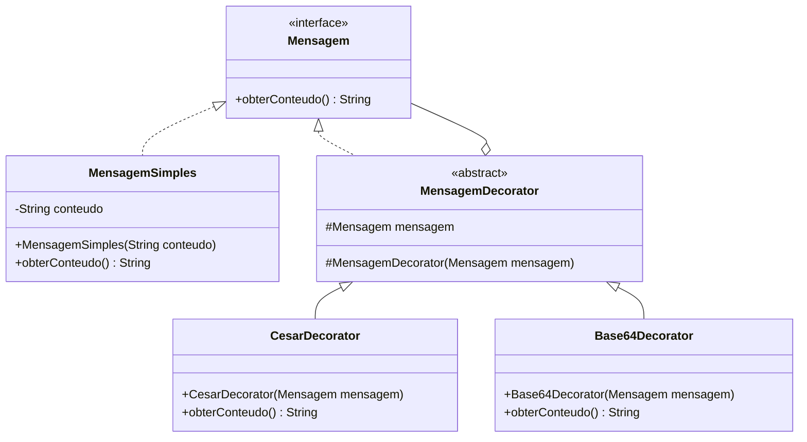

# Diagrama - Decorator: mensagem criptografada

```mermaid
classDiagram
    class Mensagem {
        <<interface>>
        +obterConteudo() String
    }

    class MensagemSimples {
        -String conteudo
        +MensagemSimples(String conteudo)
        +obterConteudo() String
    }

    class MensagemDecorator {
        <<abstract>>
        #Mensagem mensagem
        #MensagemDecorator(Mensagem mensagem)
    }

    class CesarDecorator {
        +CesarDecorator(Mensagem mensagem)
        +obterConteudo() String
    }

    class Base64Decorator {
        +Base64Decorator(Mensagem mensagem)
        +obterConteudo() String
    }

    Mensagem <|.. MensagemSimples
    Mensagem <|.. MensagemDecorator
    MensagemDecorator o-- Mensagem
    MensagemDecorator <|-- CesarDecorator
    MensagemDecorator <|-- Base64Decorator
```
